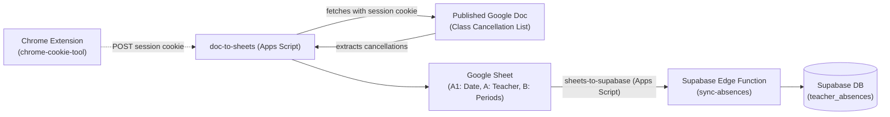

# absence-sync

Automated pipeline syncing BCA teacher attendance and class cancellations from the published Google Doc to Google Sheets and Supabase.

## Architecture

---

## 0. chrome-cookie-tool (Chrome Extension)

Located in `../chrome-cookie-tool`, this Manifest V3 Chrome Extension solves the domain-sign-in restriction on the published Google Doc. Whenever you browse Chrome on your laptop, it captures your active Google session cookies and syncs them to `doc-to-sheets` via a Web App endpoint (`doPost`), keeping `DOC_COOKIE` fresh 24/7 without needing a dedicated server.

See [chrome-cookie-tool README](../../chrome-cookie-tool/README.md) for extension installation and setup.

---

## 1. doc-to-sheets

Google Apps Script deployed as a Web App that receives session cookies from `chrome-cookie-tool`, fetches the published BCA Class Cancellation List document, parses the date and teacher absences table, and populates the Google Sheet.

### Setup Instructions

1. Open your target Google Sheet.
2. Click **Extensions** > **Apps Script**.
3. Copy the contents of [`doc-to-sheets/Code.gs`](./doc-to-sheets/Code.gs) into `Code.gs`.
4. (Optional) If editing the manifest, enable "Show appsscript.json manifest file in editor" under Project Settings and copy [`doc-to-sheets/appsscript.json`](./doc-to-sheets/appsscript.json).
5. **Deploy as Web App**:
   - Click **Deploy** > **New deployment** > Select type: **Web app**.
   - **Execute as**: `Me`
   - **Who has access**: `Anyone`
   - Click **Deploy** and copy the **Web app URL** into the Chrome extension settings.
6. **Automation**:
   - Run `createDocToSheetsFiveMinuteTrigger()` in the Apps Script editor to create a recurring time-driven trigger that runs every 5 minutes in Google's cloud using the fresh cookie.
   - Alternatively, run `createDocToSheetsOneMinuteTrigger()` for 1-minute updates.
   - Run `testDocToSheetsSync()` to manually test.

### Google Sheet Format

- **Cell A1**: Date in `M/D/YYYY` format without leading zeroes (e.g. `9/6/2026`).
- **Row 2 onwards**:
  - **Column A**: Teacher name.
  - **Column B**: Normalized periods impacted:
    - `"All"` if the doc specifies all day.
    - Ranges (`1-3, 7-8`), standalone periods (`5`), and/or `"igs"` separated by commas (e.g. `1-3, 7-8, 5, igs`).

---

## 2. sheets-to-supabase

Google Apps Script bound to the Google Sheet that reads the staged date and teacher absences, validates the data, and sends it to the Supabase Edge Function.

### Setup Instructions

1. In the same (or bound) Google Apps Script project, configure:
   - `SUPABASE_URL`: Your Supabase project URL (e.g. `https://xyz.supabase.co`).
   - `SYNC_SECRET`: Bearer authentication secret matching your Supabase environment.
2. Run `createFiveMinuteTrigger()` to automate sync to Supabase.
3. Run `testSync()` to manually execute.

---

## 3. supabase

Contains the database migrations and Edge Function:
- `supabase/functions/sync-absences`: Validates payload, verifies teacher attendance, and updates database records.
- `supabase/migrations`: SQL migrations setting up `teacher_absences` and row-level security.
