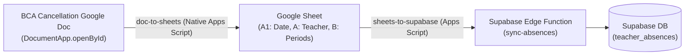

# absence-sync

Automated pipeline syncing BCA teacher attendance and class cancellations from the Google Doc directly to Google Sheets and Supabase.

## Architecture

---

## 1. doc-to-sheets (Native Google Workspace)

Natively reads the BCA Class Cancellation Google Doc using Google Apps Script's `DocumentApp`, parses the header date and cancellation table, and populates the Google Sheet.

**Key Advantages**:
- **Zero Cookies & Zero Extensions**: Uses native Google Workspace authentication under your `@bergen.org` identity.
- **Autonomous 24/7 Cloud Execution**: Runs on a time-driven trigger directly in Google's cloud without needing any computer turned on.
- **Instant Execution**: Parses document and updates sheets in under 400 milliseconds.

### Setup Instructions

1. Open your target Google Sheet.
2. Click **Extensions** > **Apps Script**.
3. Copy [`doc-to-sheets/Code.gs`](./doc-to-sheets/Code.gs) into `Code.gs`.
4. (Optional) In **Project Settings**, enable "Show 'appsscript.json' manifest file in editor" and copy [`doc-to-sheets/appsscript.json`](./doc-to-sheets/appsscript.json).
5. **Set the Document ID**:
   - In Google Drive (under your `@bergen.org` account), open or search for the BCA Class Cancellation Document.
   - Copy the document ID from the URL (`https://docs.google.com/document/d/<DOCUMENT_ID>/edit`).
   - In Apps Script, go to **Project Settings** > **Script Properties**, add property `DOC_ID` with your document ID (or paste the full URL).
   - *Tip*: You can also run `searchDriveForCancellationDoc()` in the Apps Script editor to auto-discover it!
6. **Test & Automate**:
   - Run `testDocToSheetsSync()` in the Apps Script editor to verify data is written to the sheet.
   - Run `createDocToSheetsFiveMinuteTrigger()` to automate 24/7 background sync every 5 minutes in Google Cloud!

### Google Sheet Format

- **Cell A1**: Date formatted as `M/D/YYYY` without leading zeroes (e.g. `9/6/2026`).
- **Row 2 onwards**:
  - **Column A**: Teacher name.
  - **Column B**: Normalized periods impacted:
    - `"All"` if the doc specifies all day.
    - Ranges (`1-3, 7-8`), standalone periods (`5`), and/or `"igs"` separated by commas (e.g. `1-3, 7-8, 5, igs`).

---

## 2. sheets-to-supabase (Real-Time Event-Driven)

Google Apps Script bound to the Google Sheet that watches for changes, validates the staged absences data, and pushes updates directly to the Supabase Edge Function.

**Key Features**:
- **Event-Driven Execution**: Runs immediately whenever an edit or structural change is made in the Google Sheet (via an installable `onChange` trigger).
- **Content Fingerprinting (MD5 Hashing)**: Computes a snapshot hash before calling Supabase. If an edit didn't change the parsed absence records (or if someone only clicked around/reformatted), it skips the network call to avoid unnecessary traffic.
- **Immediate Chaining with doc-to-sheets**: When placed in the same Google Sheet Apps Script project, `doc-to-sheets` automatically chains into `syncAbsences()` upon writing to the sheet, providing zero-latency end-to-end sync.
- **Concurrency Locking**: Uses Google Apps Script's `LockService` to prevent race conditions during rapid consecutive edits.

### Setup Instructions

1. In the same (or bound) Google Apps Script project, configure Script Properties:
   - `SUPABASE_URL`: Your Supabase project URL (e.g. `https://xyz.supabase.co`).
   - `SYNC_SECRET`: Bearer authentication secret matching your Supabase environment.
   - `SHEET_NAME` *(optional)*: Specific sheet tab name if your workbook has multiple tabs.
2. In the Apps Script toolbar, select function `createSheetChangeTrigger` and click **Run**.
   - This sets up the installable `onChange` trigger and cleans up any old triggers.
3. Test your connection:
   - Run `testSync()` (or `forceSyncAbsences()`) to perform a forced sync and verify the response from Supabase.
   - Edit a cell in the sheet and check **Executions** in Apps Script to see the real-time trigger in action!

---

## 3. supabase

Contains the database migrations and Edge Function:
- `supabase/functions/sync-absences`: Validates payload, verifies teacher attendance, and updates database records.
- `supabase/migrations`: SQL migrations setting up `teacher_absences` and row-level security.
